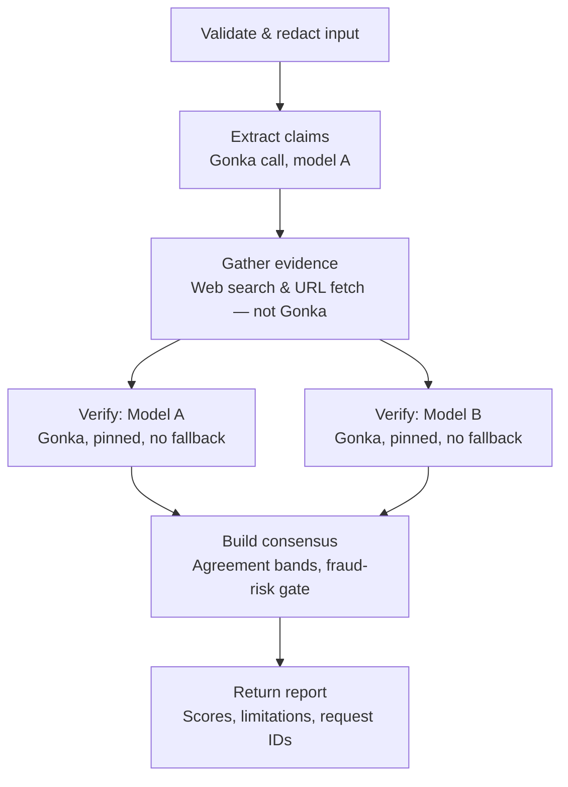

## Internal Process

Under the hood, a submission goes through six stages. First, input is validated and personally identifiable details are redacted before anything is sent externally. The system then makes its first Gonka call to extract the atomic factual claims from the text using Model A. Evidence gathering happens next, but entirely outside Gonka — this is local web search and URL fetching, not a model call. With claims and evidence in hand, two independent Gonka calls run concurrently: Model A and Model B each verify the claims separately, with no fallback if one is unavailable. Their outputs feed a consensus step that isn't a simple average — fraud risk is taken as the maximum of the two models' scores (so a scam pattern one model catches isn't diluted by the other), and a high fraud-risk verdict overrides the evidence-availability check, since phishing messages often have no retrievable evidence by nature. The final report includes scores, any limitations (e.g. single-model results if one leg failed), and the Gonka request IDs for transparency.