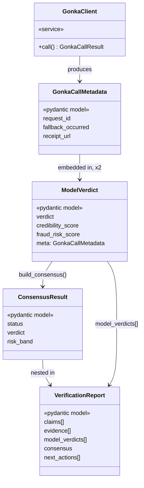

## Class / Service Diagram

The backend is function-first rather than deeply object-oriented — most logic lives as plain functions in modules (verifier.py, consensus.py, evidence.py), not class hierarchies. The one real service class is GonkaClient, which wraps every call to the Gonka Router and returns a GonkaCallResult, converted into a GonkaCallMetadata object for transparency (request ID, fallback status, receipt URL). Each model's independent judgment is captured as a ModelVerdict, which embeds that metadata. build_consensus() takes the two ModelVerdict instances and produces a single ConsensusResult — never a simple average, since fraud risk is deliberately taken as the maximum of the two. The final VerificationReport nests the consensus alongside both raw model verdicts, the extracted claims, and the evidence list, giving the frontend everything it needs for both the headline result and the transparency panel in one response.