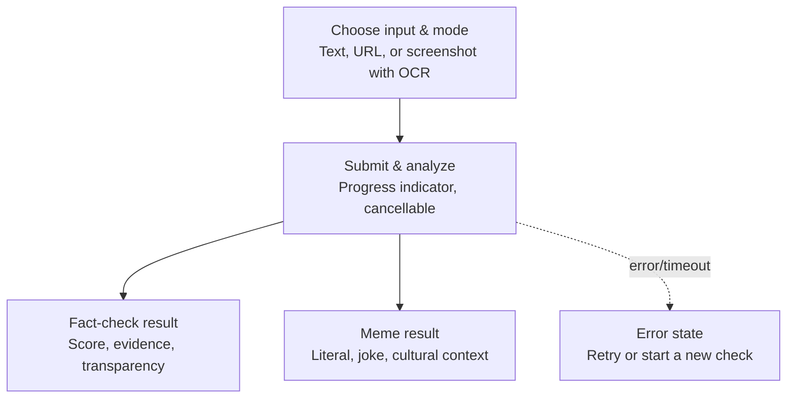

## User Flow

Anxin runs as a single continuous screen rather than separate pages. A user picks how they're submitting content — pasted text, a URL, or a screenshot (run through OCR first) — and chooses whether they want a fact-check or a meme/joke explanation. Once submitted, a cancellable progress indicator tracks the analysis. Fact-checks return a truth score, fraud-risk level, supporting evidence, and an expandable transparency panel showing exactly which models were used and their raw responses. Meme mode instead returns a plain-language explanation of the joke or cultural reference, skipping verification entirely. If anything fails — a Gonka timeout, malformed output, or network issue — the user lands on a clear error state with the option to retry or start over, rather than a silent failure.